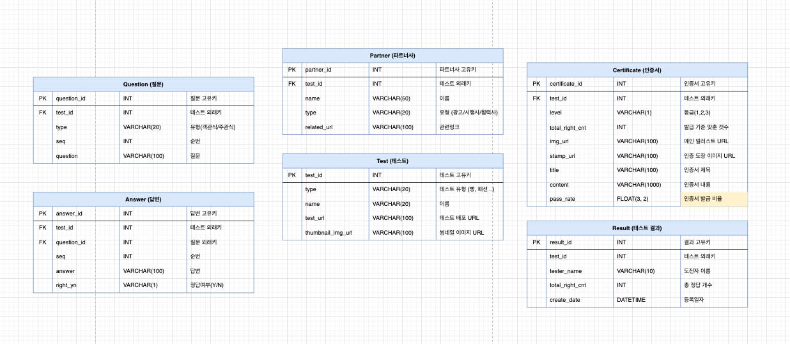

## [서울 빵 맛집 잘알 테스트](https://arirang.docking.zone/)
> 도킹프로젝트 첫번째, 아리랑 1호 - 빵전문가를 판별해주는 심리테스트 서비스

## Live Link
👉 [서울 빵 맛집 잘알 테스트 하러가기](https://arirang.docking.zone/)

## About the Project
자칭 빵 맛집 전문가들은 뚜렷한 인증제도가 없어서 쉽사리 무시되곤 한다. 빵을 사랑하고 세상의 모든 빵 맛집을 꿰뚫고 있는 그들에게 빵 전문가 자격증을 발급해줌으로서 자존감을 회복할 수 있는 계기를 마련하고자 했다.

## Screenshots

## Technologies Used

## DB ERD
> 👉 [Go to ERD](https://app.diagrams.net/#G1Ffroh4KEnoHPf2pAz_jHfBrCZjScAcd-)

## Journey
> 작업자 두 명 모두 직장인인 관계로 약 30일 간 틈날때마다 조금씩 작업을 진행

### 2021.08
- 아이디어 구상
- 서비스 기획
- 빵지순례좌 질문지 제작
- 필요한 기술검토
- [개발설계](https://app.diagrams.net/#G1Ffroh4KEnoHPf2pAz_jHfBrCZjScAcd-)
### 2021.09
- 디자인 UX/UI
- [도킹프로젝트 소개글 작성](https://spiky-glass-379.notion.site/861ce3989a6e469d92a1b15a7e9d0d7e)
- 프론트 기술 공부 : `javascript`, `reactJS`, `styled-components`, `aws-amplify`
- 프론트 & 백엔드 개발 진행
### 2021.10
- 개발보완
- QA
- 릴리즈

## Status

[comment]: <> (![in-active-status]&#40;https://img.shields.io/badge/status-inactive-FF0000.svg&#41;)

## Thanks to
- 자바스크립트, 리엑트 문외한이 한 달만에 테스트 사이트를 제작할 수 있게 도와주신 [벨로퍼트](https://react.vlpt.us) 님, 감사합니다 🙏
- 게으른 개발자를 열심히 케어해주신 공동작업자님, 감사합니다 🙏

## Authors
- 
- 

## ETC
### About Docking Project
👉 [About Docking Project](https://spiky-glass-379.notion.site/861ce3989a6e469d92a1b15a7e9d0d7e)

### Related Repository
👉 [서울 빵 맛집 잘알 테스트 FrontEnd Repository](https://github.com/Miniminis/arirang-first-project-front)